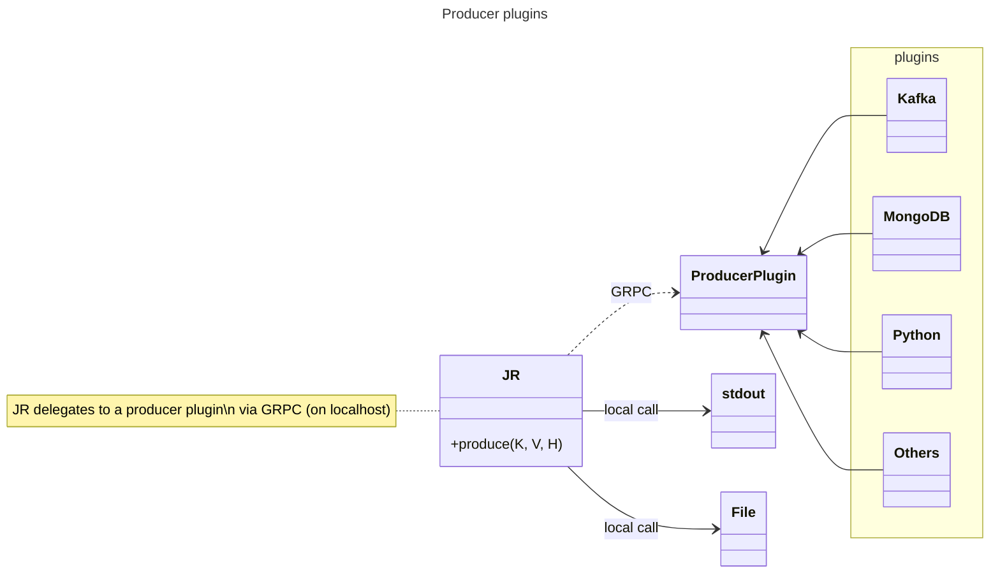
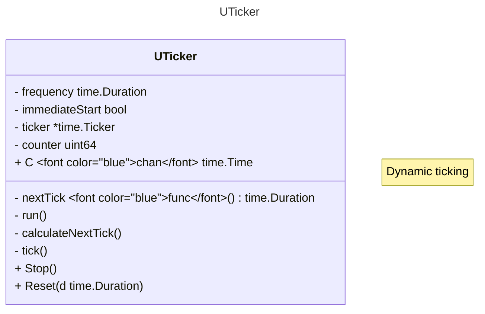

---
# Title, summary, and page position.
linktitle: JR Internals
weight: 700
#icon: book
icon_pack: fas

# Page metadata.
title: JR Internals
date: '2024-02-02T00:00:00Z'
type: book # Do not modify.
---

In this section you can find informations about _jr_ internals. This section won't explain all the decisions/internals of _jr_, but we'll try to explain everything we think is relevant to understand it.

## Architecture

## Plugins

_jr_ uses [hashicorp plugin framework](https://github.com/hashicorp/go-plugin) to implement producers.
Stdout and File plugins are "local", meaning it's a local call. Other plugins are on GRPC on localhost so they
are not part of the JR binary.

If you need one of those, it must be deployed in the `plugins` directory.

## Ticker

UTicker is a dynamic ticker. You can change teh tick with several prebuilt functions or write your own

